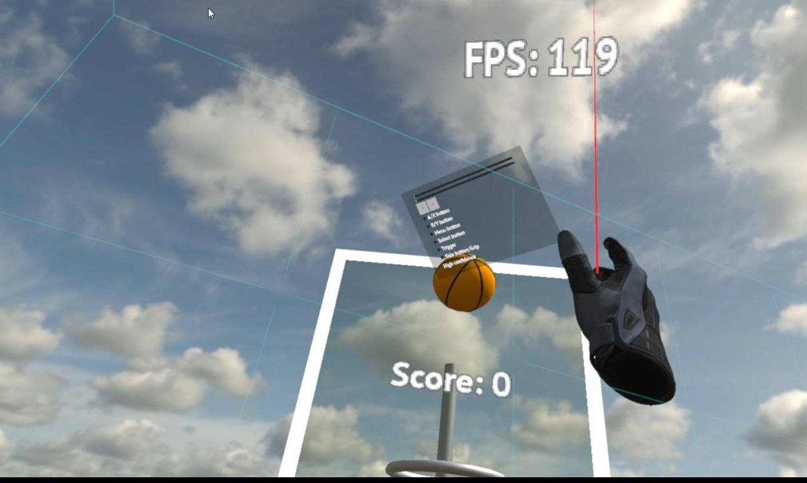

# Godot OpenXR plugin




## Versions

Requires Godot 3.4 or later. OpenXR support in Godot 4 is now available in the core without the need of a plugin.
Only supports Windows (SteamVR, Oculus runtime), Linux (SteamVR, Monado) and Meta Quest.

See [Branches, Tags and versions](https://github.com/GodotVR/godot_openxr/issues/81) for more info on stable and development branches in this repository.

## Status

* This plugin supports Linux/X11, Windows and Android (Meta Quest only).
* VR is tested with SteamVR, Monado and Oculus runtimes.
* Support for most common controllers, additional controllers can be configured using OpenXRConfig.
* The WMR OpenXR runtime is not supported as Godot is an OpenGL renderer.

## Documentation

The official documentation is available on [the Godot official documentation website](https://docs.godotengine.org/en/stable/tutorials/vr/openxr/index.html).

## Building this module

In order to compile this module you will have to clone the source code to disk. You will need a C/C++ compiler, python and scons installed. This is the same toolchain you will need in order to compile Godot from master. The documentation on Godot is a very good place to read up on this. It is too much information to duplicate here.
You will also need cmake if you're compiling the OpenXR SDK loader

### Godot-cpp

Currently this project includes the godot-cpp repository as a submodule.
If you do not already have this repositories downloaded you can execute:
```
git submodule update --init --recursive
```
To download the required version.
This will also include the `godot-headers` submodule.

This submodule needs to be compiled with the following
```
cd thirdparty/godot-cpp
scons platform=<platform> target=release generate_bindings=yes
cd ../..
```
Replace `<platform>` with `linux` or `windows` depending on your platform.

### OpenXR SDK loader

OpenXR on desktop PCs usually requires using a loader provided by Khronos, you can find the source here: https://github.com/KhronosGroup/OpenXR-SDK

On Linux the loader and include files should be installed system wide via package manager (or manually) within the `/usr` folder structure and they should be picked up automatically.

On Windows a precompiled version of the loaded can be found in `openxr_loader`, currently only the x86 version is used.
You can download the latest version from: https://github.com/KhronosGroup/OpenXR-SDK/releases

### Compiling the plugin

If everything is in place compiling should be pretty straight forward

For Windows: ```scons platform=windows```
For Linux: ```scons platform=linux```

On older linux distributions (e.g. Ubuntu 18.04) the plugin may not build with gcc.
In this case install clang and compile the plugin with ```scons use_llvm=yes platform=linux```

Currently there is no proper OpenXR support on OSX.

The compiled plugin and related files will be placed in `demo/addons/`.
When using godot_openxr in another project, copy this directory.

If you compile with gcc and encounter the error message
```
sorry, unimplemented: non-trivial designated initializers not supported
```
it probably means your gcc is too old (e.g. Ubuntu 18.04).
The easiest way around this is to compile the plugin with clang instead.
```
apt install clang
scons platform=linux use_llvm=yes
```

### Compiling for Android

For Android (Meta Quest) the build process is slightly different. Note that currently the build process assumes that `godot-cpp` was build for either windows or linux plugin, if not you will need to manually run the python script that creates the wrapper code.

On Android we use `gradlew` instead of `scons` for building the library. The toolset should be installed automatically if you install Android Studio.

To build run:
```
gradlew generateSharedLibs
```

## Prebuild libraries
If you do not want to compile the OpenXR plugin yourself goto the [releases page](https://github.com/GodotVR/godot_openxr/releases) where you can get prebuild copies of the plugin.
Simply download and unzip the contents into your Godot project.

## Debugging

If you want to debug the module make sure you use a copy of the godot binary build with either `target=release_debug` or `target=debug` provided to scons and that you build the plugin using `target=debug`. This will ensure debugging symbol files are created.

### using Android Studio

The project contains the necessary configurations to allow building and debugging within Android Studio.

To do so:
- Open the `demo` project first within the Godot Editor. This will generate the `.import` directory which is necessary for the next steps.
- Load the project within Android Studio by selecting the `settings.gradle` file in the root directory
- In the `Configurations` drop-down menu, select `android_samples.demo`
- Select `Oculus Quest` (or `Oculus Quest 2`) in the `Devices` drop-down menu
- Click the `Run` icon (or `Debug` icon if debugging) to have the IDE build the apk and push it to the device

### using VS code

I've only tested debugging using VS code on Windows with the MSVC C++ compiler but VS Code has good templates to get you up and running on Linux or on MinGW as well. Make sure you have the C/C++ extensions installed and the debugger installed.

Either manually create a .vscode folder or let vs code do this for you and setup the following two files:

`launch.json`
```
{
    "version": "0.2.0",
    "configurations": [
        {
            "name": "Runtime Launch",
            "type": "cppvsdbg",
            "request": "launch",
            "program": "/path-to-godot/bin/godot.windows.opt.tools.64.exe",
            "args": [
                "--path",
                "demo"
            ],
            "stopAtEntry": false,
            "cwd": "${workspaceFolder}",
            "environment": [],
            "console": "integratedTerminal",
            "preLaunchTask": "build"
        },
        {
            "name": "Editor Launch",
            "type": "cppvsdbg",
            "request": "launch",
            "program": "/path-to-godot/bin/godot.windows.opt.tools.64.exe",
            "args": [
                "-e",
                "--path",
                "demo"
            ],
            "stopAtEntry": false,
            "cwd": "${workspaceFolder}",
            "environment": [],
            "console": "externalTerminal",
            "preLaunchTask": "build"
        }
    ]
}
```
Be sure to change `path-to-godot` to the actual path that contains your godot source and adjust the name of the godot executable as it may change depending on your compiler settings.
Note that two options are provided, launching the demo project, or opening the demo project in the Godot editor.

`tasks.json`
```
{
    // See https://go.microsoft.com/fwlink/?LinkId=733558
    // for the documentation about the tasks.json format
    "version": "2.0.0",
    "tasks": [
        {
            "label": "build",
            "type": "shell",
            "command": "scons",
            "group": "build",
            "args": [
                "platform=windows",
                "target=debug",
                "-j8"
            ],
            "problemMatcher": "$msCompile"
        }
    ]
}
```
Note that our build script does *not* build godot-cpp!

## Testing

After compiling the plugin, start Godot, open the godot_openxr/demo project and click play.

## Demo

There is a demo project contained within this repository as well that shows how to set things up.

## Hooks

When contributing to the source code for the plugin we highly recommend you installed clang-format and copy the contents of the `hooks` folder into the folder `.git/hooks/`.
This will ensure clang-format is run on any changed files before commiting the changes to github and prevent disappointment when formatting issues prevent changes from being merged.

## License

The source code for the module is released under MIT license (see license file).

The hand models in the plugin are Copyright (c) Valve, see the folder for their license file.

## About this repository

This repository is mainly being maintained by:
- [Christoph Haag](https://github.com/ChristophHaag/) who is responsible for Linux support of this plugin.
- [Bastiaan Olij](https://github.com/BastiaanOlij) who is responsible for Windows support of this plugin.
- [Fredia Huya-Kouadio](https://github.com/m4gr3d) who is responsible for Android/Quest support of this plugin.

See contributors file for other people involved in this plugin.

Originally hosted on https://gitlab.freedesktop.org/monado/demos/godot_openxr now lives on https://github.com/GodotVR/godot_openxr
